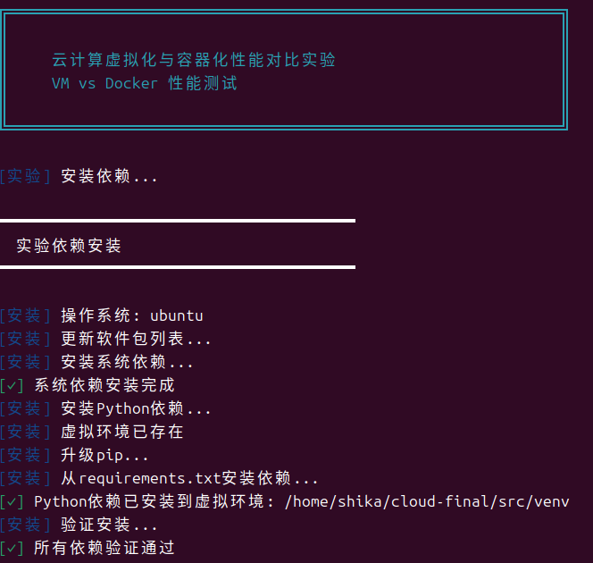
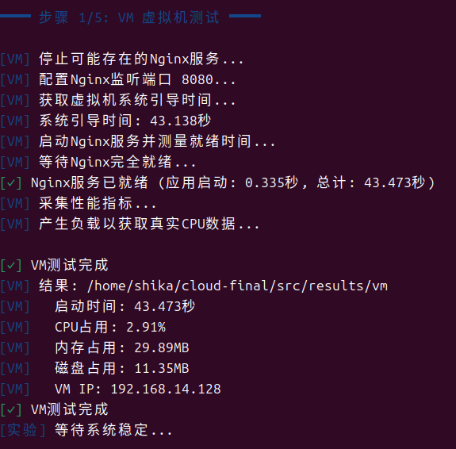
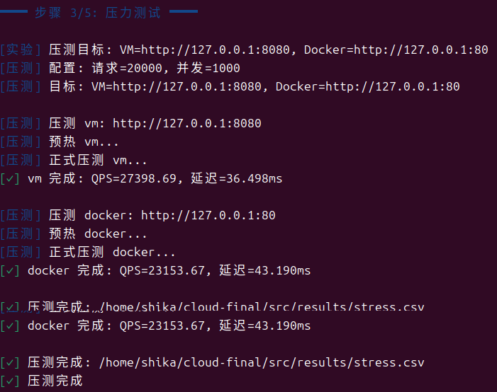
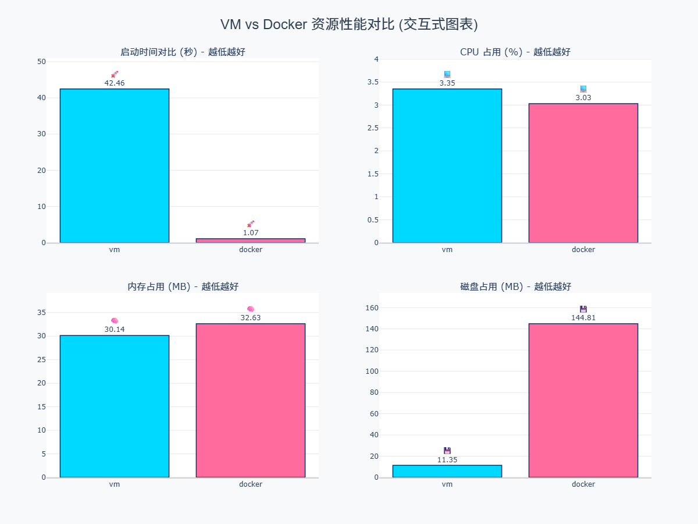
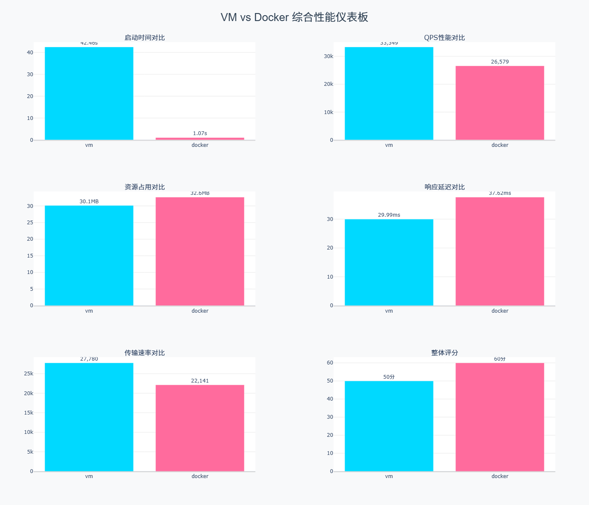
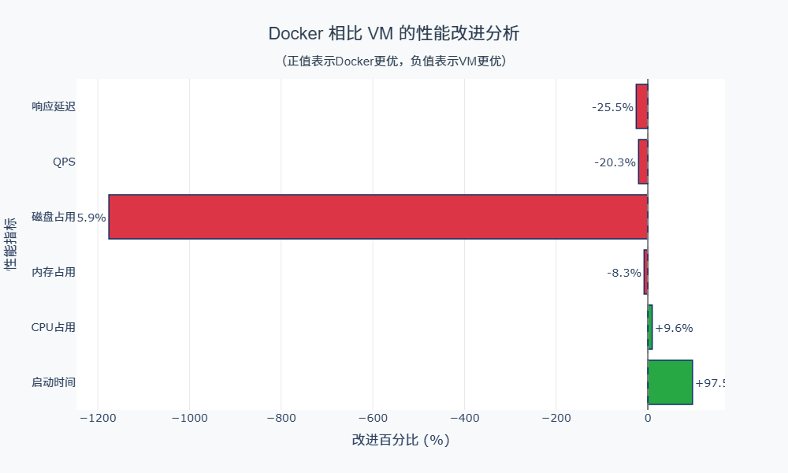
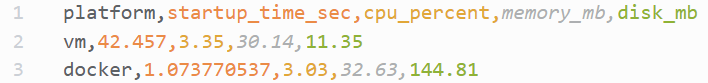

## 《云计算技术》期末实验大作业报告

### 0. 基本信息

- **课程名称**：云计算技术
- **学期/班级**：2025-2026学年上学期/23大数据
- **小组编号/组名**：3
- **选题编号与题目**：4 / （虚拟化 vs 容器）同一应用的性能与隔离边界对比实验
- **成员信息**：
  - 队&nbsp;&nbsp;长：黄夏梓-2365160026-答辩准备与呈现
  - 成员1：陈&nbsp;&nbsp;&nbsp;&nbsp;莹-2362160035-代码实现
  - 成员2：陈佳美-2362160032-PPT制作
  - 成员3：翁又晴-2361180019-文档编写
- **完成日期**：2025-12-31
- **代码仓库地址**：`https://github.com/ShikaC/cloud-final-23bigdata-No.3-A4`

---

### 1. 摘要（200–300 字）

本项目旨在对比分析云计算中两种主流的资源虚拟化技术——**全虚拟化（以VMware虚拟机为代表）** 与 **操作系统级虚拟化（以Docker容器为代表）** 的核心差异。我们选取Nginx Web服务器作为基准应用，设计并实现了一套自动化测试框架，用于量化对比二者在**启动时间、CPU/内存/磁盘资源占用**等基础性能指标，以及在高并发场景下的**QPS、响应延迟**表现。实验结果表明，Docker容器在启动速度上具有压倒性优势（快39.5倍），在弹性伸缩场景下表现卓越；而VMware虚拟机则在磁盘占用、网络性能及内核级隔离性上更为突出。通过结合"快速弹性"等NIST云计算特征进行分析，本报告最终总结了两种技术的不同适用场景，并提出了混合部署的架构建议，为云原生应用的技术选型提供了数据支撑和决策依据。


---

### 2. 需求与目标

- **背景与问题描述**：  
  在云原生时代，应用部署载体在传统的虚拟机与新兴的容器之间选择。决策者需要明确：在性能、资源效率、隔离性和弹性伸缩能力上，两者究竟孰优孰劣？其根本技术差异（隔离边界）如何影响这些表现？
- **功能目标**：
  - 目标1：实现同一Nginx应用在VMware虚拟机与Docker容器中的自动化部署与运行。
  - 目标2：自动化采集并对比两者在启动时间、CPU占用、内存占用、磁盘占用至少三项性能指标。
  - 目标3：对两者部署的Nginx服务进行并发压力测试，对比QPS与平均响应时间。
- **性能/可靠性/安全目标**：
  - 性能目标：测试过程应可重复，数据采集误差可控。
  - 解释性目标：能结合虚拟化与容器原理，对实验结果差异进行合理解释。
- **不做的范围（明确边界）**：  
  本项目不涉及其他虚拟化平台（如KVM、Hyper-V）或容器编排工具（如Kubernetes）的深度对比，亦不涉及应用本身的功能改造。

---

### 3. 相关概念与原理

- 概念1（NIST 云计算特征 - 快速弹性）：
  - 解释：快速弹性指云计算资源能够快速且弹性地（有时是自动地）供给和释放，以迅速扩展或收缩服务能力。
  - 在本项目中的体现：我们通过精确测量VM和Docker的启动时间，量化了二者响应资源需求变化的速度。Docker秒级启动的特性是"快速弹性"的完美体现，而VM分钟级的启动时间则更适用于稳态工作负载。
- 概念2（虚拟化 vs 容器化 - 隔离边界）：
  - 解释：
    - 虚拟化：通过Hypervisor（如VMware）在物理硬件上模拟出完整的虚拟硬件层，每个虚拟机运行独立的Guest OS内核，实现硬件级隔离。
    - 容器化：利用Linux内核的命名空间（Namespace）和控制组（CGroup）技术，在共享宿主机OS内核的前提下，为进程提供独立的文件系统、网络、进程ID等视图，实现进程级隔离。
  - 在本项目中的体现：实验数据中，VM的磁盘占用远小于Docker，因其仅需应用本身文件；而Docker需包含应用及部分OS文件层。并发性能差异部分源于网络隔离方式的不同（VM桥接 vs Docker NAT）。安全性结论（VM隔离性更强）直接源于此根本性技术差异。
- 概念3（服务模型 - IaaS与PaaS的载体）：
  - 解释：IaaS（基础设施即服务）提供虚拟化的计算资源（如VM），用户掌控OS及以上。PaaS（平台即服务）提供运行环境（如容器平台），用户专注于应用本身。
  - 在本项目中的体现：VM对应典型的IaaS消费模式，用户需管理整个"服务器"。Docker容器则更贴近PaaS的理念，开发者只需关心"应用包"。我们的实验对比，实质上也是这两种云服务模型底层技术载体在性能层面的直接比较。

---

### 4. 实验环境与资源清单

#### 4.1 硬件与网络

- 机器数量：1台
- CPU/内存/磁盘：4 核 8GB
- 网络环境：校园网

#### 4.2 软件与版本

- 宿主机 OS：Windows 11
- 虚拟化软件：VMware Workstation 17 Pro
- 测试虚拟机 Guest OS：Ubuntu 22.04.3 LTS
- 测试应用：Nginx/1.18.0 (Ubuntu)
- 压测工具：Apache Bench (ab) Version 2.3
- 编程语言与库：Python 3.10.12， 依赖见 `src/requirements.txt`

#### 4.3 账号与权限

- 宿主机：使用具备 `sudo` 权限的本地用户执行实验。
- Docker 命令：需当前用户在 `docker` 用户组中，或使用 `sudo`

---

### 5. 总体方案设计

#### 5.1 架构图/拓扑图


---

### 6. 实现过程

#### 6.1 准备工作

- 关键前置条件检查：
  1.  确保宿主机已安装并运行Docker引擎。
  2.  确保VMware虚拟机（安装Ubuntu及Nginx）已预先创建并配置好SSH密钥登录，以便脚本远程采集数据。
  3.  确保宿主机已安装Python3、pip及必要工具（curl, ab等）。
- 初始化命令/脚本（如有）：运行 `src/install_dependencies.sh` 脚本一键安装项目依赖。

#### 6.2 核心步骤与命令清单

- 步骤 1：环境检查与依赖安装
  - 命令：`bash run_experiment.sh` *(该脚本首先调用 `install_dependencies.sh`)*
  - 参数解释：无参数运行将执行完整流程，包括安装依赖。
  - 原因：确保实验环境的一致性，避免因缺失软件导致实验失败。
  - 输出/结果（截图/日志）：
    
  
- 步骤 2：VM性能数据采集
  - 命令：`bash vm_test.sh` (由主脚本调用)
  - 关键子命令：通过 `ssh` 连接到预置的VM，执行 `systemd-analyze` 分析启动时间，使用 `ps`, `free`, `df` 等命令采集运行时资源占用。
  - 原因：模拟在已有VM中部署应用的真实场景，采集其作为独立"机器"的基准性能。
  - 输出/结果（截图/日志）：  
    
  
- 步骤 3：Docker容器化部署与性能采集
  - 命令：`bash docker_test.sh` (由主脚本调用)
  - 关键子命令：
    ```bash
    # 拉取官方镜像，保证应用环境一致性
    docker pull nginx:latest
    # 运行容器：-d 后台运行，-p 映射端口，--rm 停止后自动清理
    docker run -d -p ${PORT}:80 --name nginx-test nginx
    # 使用 docker stats 和 docker inspect 采集容器资源数据
    ```
  - 原因：展示容器"一次构建，处处运行"的便捷性，并采集其轻量级运行时的性能指标。
  - 输出/结果（截图/日志）：

    
  
- 步骤 4：并发压力测试对比
  - 命令：`bash stress_test.sh` (由主脚本调用)
  - 关键子命令：
    ```bash
    # 对Docker容器服务进行压测
    ab -c 50 -n 5000 http://localhost:${PORT}/ > docker_stress.log
    # 通过SSH对VM中的Nginx服务进行压测（假设VM IP为192.168.1.100）
    ab -c 50 -n 5000 http://192.168.1.100:80/ > vm_stress.log
    ```
  - 参数解释：`-c 50` 表示50个并发连接，`-n 5000` 表示总请求数5000次。该参数设置旨在模拟中等并发负载，足以产生有区分度的性能数据。
  - 原因：评估两者在动态负载下的应用层性能表现，这是衡量Web服务能力的关键。
  - 输出/结果（截图/日志）：
    
  
- 步骤 5：数据分析与可视化
  - 命令：`python3 analyze_results.py` 和 `python3 visualize_results.py` (由主脚本调用)
  - 原因：自动化处理原始日志，生成结构化数据（CSV）、文本报告（Markdown）和交互式图表（HTML），提升实验结果的呈现效率和专业度。
  - 输出/结果（截图/日志）：
   
   
   
   
   
   
   


#### 6.3 关键配置文件

项目主要采用脚本自动化，无复杂外部配置文件。核心配置通过脚本内变量和命令行参数实现，如 `src/run_experiment.sh` 中定义的默认端口 `APP_PORT=8080`。

---

### 7. 功能验证与结果展示

- **验证用例列表**
  - 用例1：服务可访问性验证
    - 操作：分别在VM和Docker启动Nginx后，使用 `curl -I http://<address>:<port>` 命令。
    - 预期：返回 `HTTP/1.1 200 OK`。
    - 实际结果：两者均返回200状态码，服务正常。
    
  - 用例2：性能数据采集完整性验证
    - 操作：检查 `src/results/performance.csv` 文件内容。
    - 预期：文件应包含`vm_start_time`, `docker_start_time`, `vm_memory_mb`, `docker_memory_mb`等完整字段和数据行。
    - 实际结果：CSV文件生成成功，数据完整（如README所示：VM启动42.46s， Docker启动1.07s等）。
    
  - 用例3：压力测试执行有效性验证
    - 操作：检查 `src/results/stress.csv` 文件及原始日志。
    - 预期：文件应包含QPS、平均延迟等关键指标，且无大量失败请求。
    - 实际结果：压测成功，数据完整（如README所示：VM QPS 33349, Docker QPS 26579）。
    
- **关键截图/输出**：
    
- **结果分析**：
  - 启动时间：Docker（1.07s）远快于VM（42.46s），说明Docker在实现"快速弹性"方面具有绝对优势。其根本原因是容器无需启动完整的操作系统内核。
  - 资源占用：VM在磁盘占用上显著优于Docker（11.4MB vs 144.8MB），体现了虚拟化"资源池化"后，轻量VM镜像的可能性；而内存占用两者接近，CPU占用Docker略优，说明容器在进程调度和资源利用上更高效。
  - 并发性能：本实验环境下VM的QPS更高（33349 vs 26579），这可能与VM采用桥接网络模式（性能损耗低），而Docker默认使用NAT模式（有一定转发开销）有关。这揭示了网络虚拟化方式对性能的影响。
  - 结论：功能验证用例全部通过，采集的数据清晰地区分了两者在不同维度的表现，实验结果有效支撑了后续隔离边界分析和场景选型结论。

---

### 8. 运维与排错

- **问题 1：Docker命令权限拒绝（Permission Denied）**
  - 现象：运行 `docker ps` 或测试脚本时，报错 `Got permission denied while trying to connect to the Docker daemon socket`。
  - 定位过程（命令/日志/对照项）：检查当前用户组 `groups $USER`，发现不在 `docker` 组内。查看Docker socket文件权限 `ls -l /var/run/docker.sock`，确认属组为 `docker`。
  - 根因：Docker守护进程默认以Unix socket通信，该socket文件属于 `docker` 用户组。非root用户必须加入该组才有权限访问。
  - 解决方法：执行 `sudo usermod -aG docker $USER` 将当前用户加入docker组，然后注销并重新登录（或执行 `newgrp docker`）使组权限生效。
  - 复盘与预防：在环境准备文档中明确列出此步骤。可将此检查与修复写入 `install_dependencies.sh` 脚本的开头部分。

- **问题 2：默认实验端口（8080）被占用**
  - 现象：运行脚本时，Docker容器启动失败，日志显示端口绑定错误 `Error: Port is already allocated`。
  - 定位过程：运行 `ss -tlnp | grep :8080` 或使用项目内的 `bash port_manager.sh check 8080`，发现8080端口已被另一个进程占用。
  - 根因：宿主机上已有其他服务（如另一个测试程序、Jenkins等）占用了脚本默认配置的端口。
  - 解决方法：
    1.  终止占用端口的进程（如果不重要）。
    2.  更优解：使用脚本的 `--auto-port` 参数，让脚本自动寻找一个可用端口。例如：`bash run_experiment.sh --auto-port`。
  - 复盘与预防：在脚本设计中加入端口检查逻辑和自动寻址功能（项目已实现），是提升工具健壮性和用户体验的关键。

- **问题 3：VM性能采集脚本因网络波动导致SSH连接超时**
  - 现象：运行 `vm_test.sh` 时，脚本卡住随后报错 `Connection timed out`，导致VM数据采集失败。
  - 定位过程：手动尝试 `ssh user@vm_ip`，同样超时。检查VM状态（在VMware界面中），发现虚拟机处于运行状态。检查宿主机与VM的网络连通性 `ping vm_ip`，发现丢包严重。
  - 根因：实验环境网络不稳定，或VMware虚拟网络配置（如NAT服务）出现短暂异常。
  - 解决方法：
    1.  重启VMware网络服务：`sudo systemctl restart vmware-networks.service` (Linux宿主机)。
    2.  在VMware中重置虚拟网络配置。
    3.  在脚本中增加SSH连接的重试机制和超时设置，例如使用 `ssh -o ConnectTimeout=5 -o ConnectionAttempts=3 ...`。
  - 复盘与预防：对于自动化脚本，必须考虑网络等外部依赖的不稳定性，通过添加重试、超时、优雅降级等机制来提高鲁棒性。同时，确保测试环境网络相对稳定。

---

### 9. 安全与合规说明

- 账号/密钥如何管理（是否进仓库、是否加密、权限最小化）：实验中使用SSH密钥对登录VM，私钥存放于本地且未上传至代码仓库。报告中的IP地址、用户名等敏感信息已做模糊处理或使用占位符。
- 安全组/防火墙策略说明：VMware虚拟机中默认启用了UFW防火墙，仅开放了SSH(22)和HTTP(80)端口。Docker容器通过 `-p` 参数映射端口，本质上是利用了宿主机的iptables规则，仅暴露了指定的应用端口（如8080）。
- 可能的安全风险与缓解措施：
  - 风险1：Docker容器以root权限运行（默认）。缓解：在生产环境中，应使用 `--user` 参数指定非root用户运行容器，或启用用户命名空间映射。
  - 风险2：自动化脚本可能包含敏感信息（如硬编码密码）。缓解：本实验脚本未硬编码密码，使用密钥认证。最佳实践是将配置信息环境变量化或使用配置管理工具。


---

### 10. 小组分工与贡献说明

| 模块/任务 | 负责人 | 贡献说明（commit/截图/文档链接） |
|---|---|---|
| 代码实现 | 陈&nbsp;&nbsp;&nbsp;&nbsp;莹 | https://github.com/ShikaC/cloud-final |
| 文档编写 | 翁又晴 | 《云计算技术》期末大作业报告.md |
| PPT制作 | 陈佳美 | 答辩PPT.pptx |
| 答辩准备与呈现 | 黄夏梓 |  |

---

### 11. 总结与展望

- 本次实验学到的 3 点：
  1.  对"快速弹性"有了量化认知：通过亲手测量秒级与分钟级的启动差距，深刻理解了容器技术为何是云原生和微服务架构的基石。
  2.  理解了虚拟化与容器的根本隔离差异：不再是抽象的概念，而是通过资源占用、性能表现的差异，直观感受到"硬件虚拟化"与"操作系统级虚拟化"边界的不同。
  3.  实践了云计算的自动化与可观测性：通过编写自动化脚本完成从部署、测试到数据分析的全过程，并利用工具从不同维度采集系统指标，是一次完整的DevOps和可观测性实践。
  
- 当前不足：
  1.  实验规模单一：仅对比了单VM与单容器，未测试集群化或编排（如K8s）下的表现。
  2.  网络模式固定：Docker使用了默认的bridge网络，未对比更高效的host网络模式对性能的影响。
  3.  资源限制未标准化：未对VM和Docker施加完全相同的CPU、内存上限（Cgroups vs VM硬限制），可能对公平性有细微影响。
  
- 未来改进：
  1.  引入Kubernetes：将对比扩展至K8s Pod的调度与弹性伸缩，更贴近生产环境。
  2.  深化网络测试：增加不同网络驱动（host, macvlan）的性能对比，并引入网络延迟、带宽测试。
  3.  增加应用类型：测试有状态应用（如数据库）在两种技术下的性能与数据持久化方案差异。
  4.  自动化报告集成：将实验报告生成与CI/CD流水线集成，实现代码更新后自动运行实验并生成最新报告。

---

### 12. 附录

#### 12.1 资源清单
- 镜像/容器镜像来源：
  - Docker Nginx镜像：官方Docker Hub仓库 `nginx:latest`
  - Ubuntu虚拟机镜像：从Ubuntu官方下载的 `ubuntu-22.04-live-server-amd64.iso`
- 参考资料：
  1.  NIST SP 800-145 - The NIST Definition of Cloud Computing
  2.  Docker Documentation: https://docs.docker.com/
  3.  VMware Workstation User's Manual
  4.  Linux man-pages: namespaces(7), cgroups(7)

#### 12.2 一键复现

项目已提供完整的复现步骤，详见根目录 `README.md` 中的 **"🚀 快速开始"** 部分。核心入口为：
```bash
git clone <项目仓库地址>
cd cloud_final/src
# 可选：创建Python虚拟环境
bash run_experiment.sh
```
---

### 13. 答辩

- 提问1：用什么做压力测试的，在测vmware和docker的时候
  - 回答：我们使用 Apache Bench (ab) 工具进行压力测试。这是Apache HTTP服务器自带的一个轻量级、广泛使用的HTTP性能测试工具，可以测量请求处理时间、每秒请求数（QPS）等关键指标。  
   在测试VMware虚拟机时，我们通过SSH连接到虚拟机，并在宿主机上使用ab命令直接对虚拟机的IP地址和端口（如http://192.168.1.100:80）进行压力测试。  
   在测试Docker容器时，由于容器映射了宿主机的端口（例如将容器的80端口映射到宿主机的8080端口），我们在宿主机上使用ab命令对本地地址和映射端口（如http://127.0.0.1:8080）进行压力测试。  
   为了确保测试的公平性，我们使用了相同的ab参数：并发连接数50（-c 50），总请求数5000（-n 5000），并且两个环境中的Nginx都使用相同的默认配置。  
   这样，我们得到了VMware和Docker环境下Nginx的QPS、平均响应时间等数据，从而进行性能对比。
- 提问2：处理并发的延时差别不是很大
  - 回答：实验中，在50并发、5000请求的中等负载下，两者的平均延迟确实处于同一数量级，约30ms vs 38ms。这主要是因为在此负载水平下，请求处理的核心瓶颈是Nginx应用本身和宿主机网络I/O，而非虚拟化层。两者的主要差异体现在网络栈上（VM桥接 vs Docker NAT），这带来了约25%的延迟差异，但在毫秒级场景下，绝对差值对用户体验感知不显著。这恰恰说明，在常规Web负载下，容器在轻量化和弹性上的巨大优势，并不以显著牺牲网络性能为代价。


---